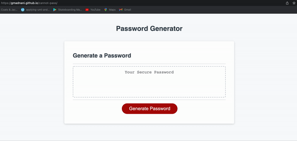
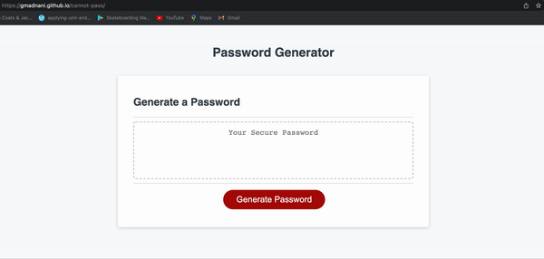
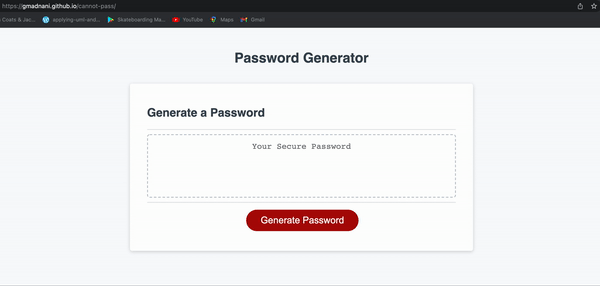

# cannot-pass

## Table of Contents
- [Task](#task)
- [GIF](#gif)
- [Website](#website)

## Task
The Purpose of this project was to create a function that generates a password based on your specifications. The password generated should be between 8-128 characters and should have at least one type of character chosen like lowercase, uppercase, numbers or special characters. when the conditions are met it generates a password.

## GIF

  
  
Fig 1: choosing appropriate length and all options

   

  
  
Fig 2: choosing wrong length and also choosing no option

   

  
  
Fig 3: choosing appropriate length and choosing only lowercase and numbers

   

## Website
https://gmadnani.github.io/cannot-pass/

https://github.com/gmadnani/cannot-pass
